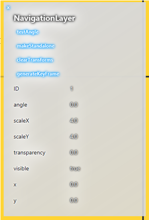
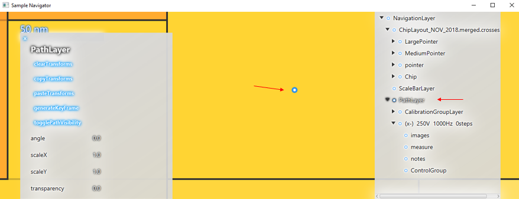
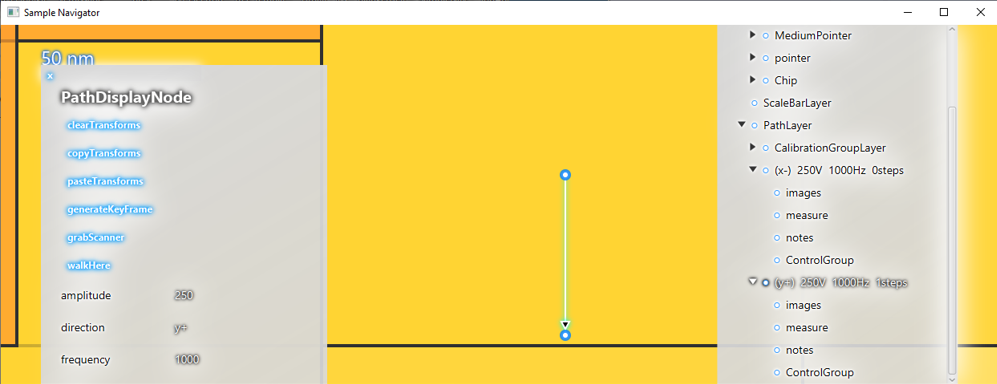
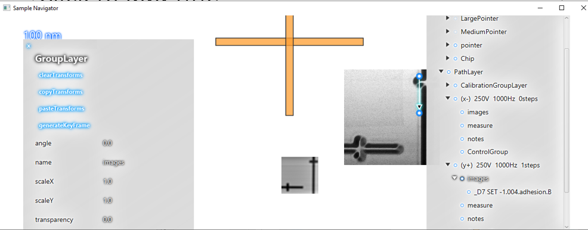
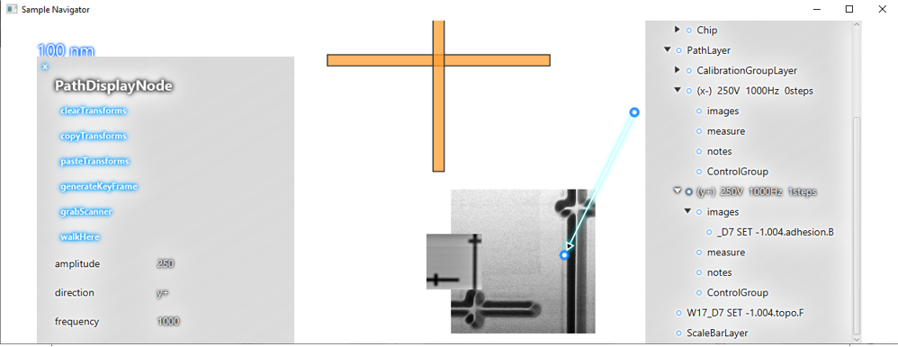
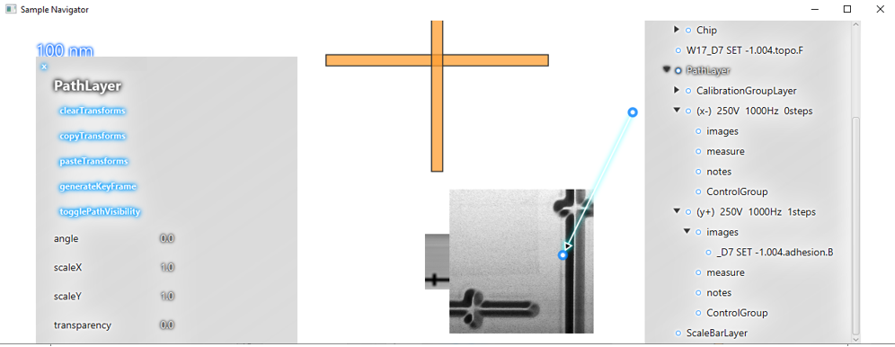
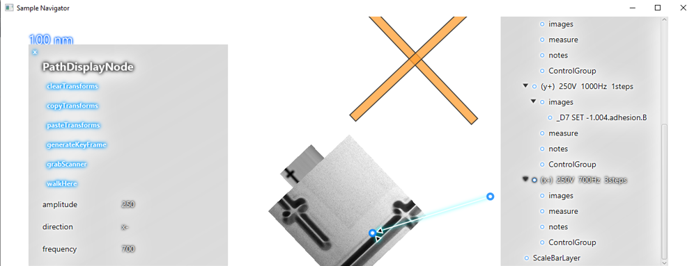
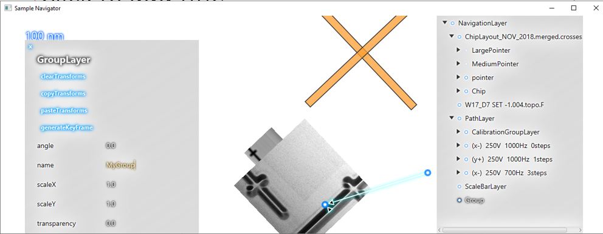
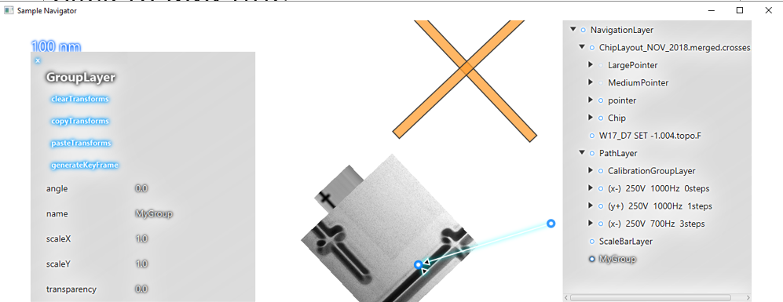

# ABDNavigator Help

## Startup
Before starting, ensure that a directory has been setup where the data will be stored which contains a navigation file.  A default navigation file can be copied from the ABDNavigator folder: [default_deviceNavigation.xml](default_deviceNavigation.xml).

When you first start ABDNavigator (using [run.bat](run.bat)) from the command line, a "file open" dialog is displayed. Find the data directory you setup and choose the navigation xml (e.g. *default_deviceNavigation.xml*) file. 

## Some First Steps
There is currently no menu system implemented, so all functionality is achieved through **hot-keys** (detailed in the next section) and operations exposed by the **Attribute Editor**.  As an introduction, here are some first steps to try:

### 1. Toggle the **Tree View** 
Press: **Ctrl** + **T**

### 2. Toggle the **Attribute Editor**
Press: **Ctrl** + **A**

### 3. Create a **PathLayer**
Select *NavigationLayer* in the **Tree View**.  Then Press: **Ctrl** + **=**

### 4. Create a course step
Select the *PathLayer* or one of the existing coars steps within it.  Then press: **=**

Now move the mouse to the new location to be coarse walked to, and click.

### 5. Add an image to the *NavigationLayer*
Select *NavigationLayer* in the **Tree View**.  Then press: **Ctrl** + **o**

In the **File Open** dialog, ensure that "Image File" is selected in the file type dropdown.

Then choose the desired image file.  This will add an image as a "child" of the *Navigation Layer*.

### 6. Zoom in and out, and move the map
Use the **middle mouse-wheel** to zoom in and out.  **Left-click** and **drag** to move around on the **map**.  Click on map objects to select them (or alternatively click on them in the **Tree View**).

### 7. Move the selected object
Select the image that was added in step 5.  While holding down **Alt**, **left-click** and **drag**.  

### 8. Hide selected objects
Select an object on the map or in the **Tree View**.  Press: **Space**.  

The selected object will be hidden, and its listing in the **Tree View** will be grayed out.

### 9. Add an image to something other than the *NavigationLayer*
Select one of the *image* groups from the **Tree View**.  Then open an image as before (using **Ctrl** + **o**).

### 10. Adjust the position of one of the coarse walk nodes
This is useful if the coarse walk calibration is a little off.  Select the node in the tree view and perform a move operation as described above (while holding **Alt**, **left-click** and **drag**).

### 11. Move the *PathLayer* in front of the image that was added to the *NavigationLayer* before
Select *PathLayer* in the **Tree View**.  Then press: **Ctrl** + **F**.

(**Ctrl** + **B** will move it backwards)

### 12. Rotate the map
**Right-click** and **drag**

### 13. Add a *Group* object to the *NavigationLayer*
Select *NavigationLayer* in the **Tree View**.  Then press: **Ctrl** + **g**.

The *Group* can be re-named by selecting it in the **Tree View** and editing the *name* attribute in the **Attribute Editor**.

For the edit to take place, make sure to press **Enter**.

### 14. Save your edits
Press: **Ctrl** + **s**

## Hot-key Reference

Key Combination | Effect
---|---
**F11** | Toggle full screen
**Ctrl** + **s** | Save
**Ctrl** + **p** | Select parent of the currently selected object
**Ctrl** + **z** | Undo
**Ctrl** + **Z** | Redo
**Ctrl** + **o** | Open file and add it to the map
**Ctrl** + **f** | Bring selected object layer forward
**Ctrl** + **b** | Move selected object layer backward
**Ctrl** + **e** | Open xml editor for selected object (**Ctrl** + **e** closes editor and keeps changes, **Esc** closes the editor and loses changes)
**F1** | Toggle help window
**Ctrl** + **a** | Toggle Attribute Editor
**Ctrl** + **t** | Toggle Tree View
**Double-click** | Enter text (**single-click** elsewhere to stop entering text, **Esc** to cancel)
**Ctrl** + **l** | Create a line segment
**Ctrl** + **g** | Create a group object

