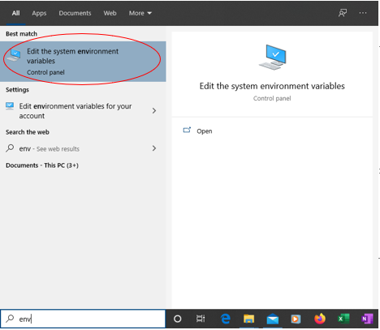

# Installation of ABDNavigator

Installation of ABDNavigator consists of compiling the source files into .class files, and copying one .css file into the appropriate location.  This is done most straightforwardly from the command line (cmd).

## 1. Install JDK 8 (if not already installed) 
The simplest way to compile is to first have JDK 8 installed (newer jdk versions require a separate download of JavaFX).  JDK 8 can be found here: https://www.oracle.com/java/technologies/javase-jdk8-downloads.html.  If not already installed, download and install the 64-bit windows version.

## 2. Set appropriate Windows path for JDK 8 (if not already set)
Next, ensure that the windows environment "path" variable is set appropriately (by default it probably will not be).
Environment Variables ->
set "path" environment variable to include the location of the "bin" directory for the JDK you installed - as an example:
C:\Program Files\Java\jdk1.8.0_241\bin

## 3. Compile the source code into .class files.
install.bat

